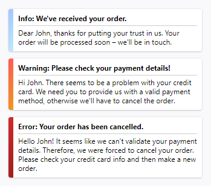

# Notifier

A simple notification module.

## Features:

* Unobtrusive notifications in the lower right corner of your user’s screen.
* Notifications are subtly animated.
* Each notification holds a title and body text.
* Three notification types: info (blue), warning (orange), and error (red).
* Info notifications automatically disappear after 90 seconds.
* Notifications can be closed with a click.
* Old notifications are grouped together.
* In the demo version, users can trigger custom notifications via a simple form.

## Instructions

* Download repository: `git clone https://github.com/nicolasschabram/notifier`
* Install React app: `npm install`
* Start development server: `npm start`
* Access demo at http://localhost:3000/
* Run tests and generate test coverage report: `npm test`

## Developers

Further information for how to use the components in your project is provided in [./docs.md](./docs.md).
